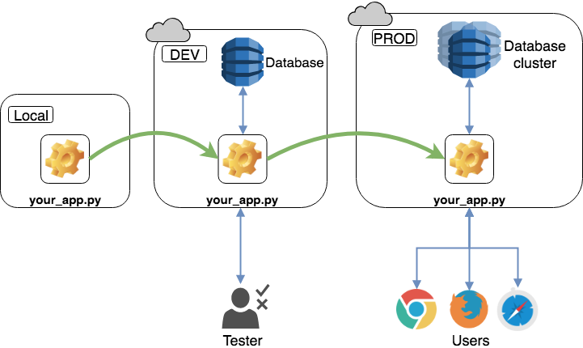

# Market Maker Lite TDA Repository
<!-- 

-->

A repository of code that interacts with the TDA-API

### Options-Data
This code loops through a list of tickers to get the entire options chain for each symbol.
It's designed to run all day, and will consistently loop through the list of tickers. 
It will automatically handle the start and end of the trading day, as well as holidays, etc. 

### Installation
* Python 3.8
* pip install -r requirements.txt

### Continuous Integration Testing

This github action allows a developer to push code changes to the repository **and** send those changes to a server. 
This video does a great job explaining how to automatically deploy a github repo to your server
https://www.youtube.com/watch?v=DufTz_ShMVw.

The purpose of integration testing on a scraper like this one is to be able to make adjustments to your without affecting the production code on the far right.
#### Testing of an App that Makes Changes to a Database

Source: https://realpython.com/python-continuous-integration/

